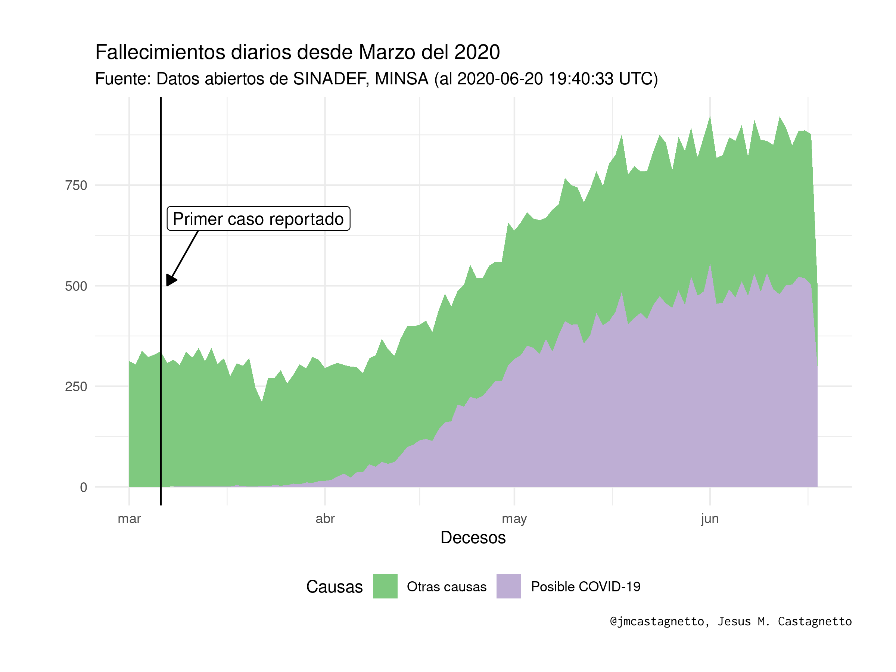
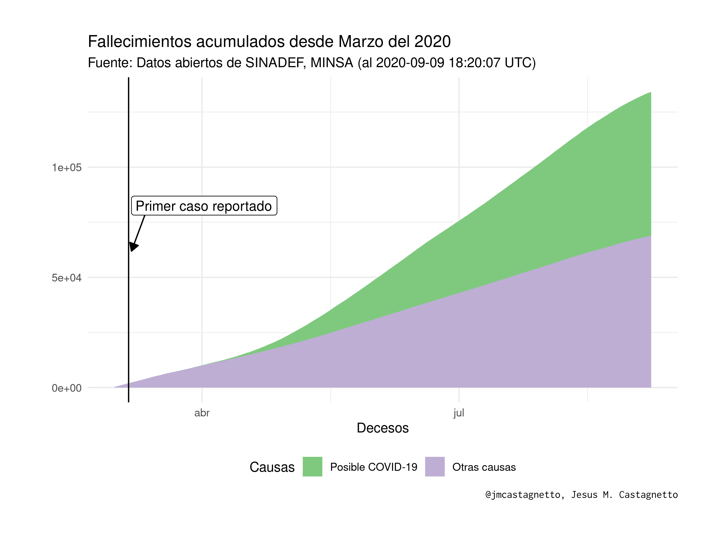

```{r include=FALSE, echo=FALSE}
library(tidyverse)
load("datos/sinadef-datos.Rdata")
hoy <- lubridate::now(tzone = "UTC")
```
**Última actualización**: `r hoy` UTC

# Fallecimientos en Perú (SINADEF)

Análisis usando los datos de 

["Información de Fallecidos del Sistema Informático Nacional de Defunciones - SINADEF - [Ministerio de Salud]"](https://www.datosabiertos.gob.pe/dataset/informaci%C3%B3n-de-fallecidos-del-sistema-inform%C3%A1tico-nacional-de-defunciones-sinadef-ministerio)

## Notas

- **2020-06-08**:
  - Hoy el formato de fecha a cambiado de "DD/MM/YYYY" a "YYYY-MM-DD"
  - Los CSV ahora se guardarán comprimidos para no llegar a los límites de github

- **2020-06-16**:
  - Con la adición de campos de causas, estoy calculando campos que marcan si las causas contienen la expresión regular: `"(CORONAVIRUS|COVID|SARS COV|SARS-COV)"` se encuentra presente, y marcar como posible registro de fallecimiento debido a COVID-19.


## Gráfico de fallecimientos por día desde marzo 2020

De los registros del SINADEF, se han empleado los 6 campos que contienen posibles causas del deceso, y se empleó la expresión regular `(CORONAVIRUS|COVID|SARS COV|SARS-COV)` para encontrar aquellas causas que pudieran ser por COVID-19. Luego, se marcaron los registros con al menos un campo que correspondía a la expresión regular mencioanada.

```{r}
desdeMarzo <- sinadef_df %>% 
  filter(anho == 2020 & mes >= 3) %>% 
  group_by(fecha, covid19_causa) %>% 
  tally() %>% 
  group_by(covid19_causa) %>% 
  mutate(
    csum = cumsum(n),
    causa_lbl = if_else(covid19_causa, "Posible COVID-19", "Otras causas")
  )
tmp <- Sys.setlocale("LC_TIME", "es_PE.utf8")
p1 <- ggplot(desdeMarzo, aes(x = fecha, y = n, 
                       group = causa_lbl, fill = causa_lbl)) +
  geom_area() +
  geom_vline(xintercept = as.Date("2020-03-06")) +
  annotate("segment", x = as.Date("2020-03-13"), y = 1.2*max(desdeMarzo$n),
           xend = as.Date("2020-03-07"), yend = 0.9*max(desdeMarzo$n),
           arrow = arrow(length = unit(.25, "cm"), type = "closed")) +
  annotate("label", x = as.Date("2020-03-07"), y = 1.2*max(desdeMarzo$n),
           label = "Primer caso reportado", hjust = 0) +
  scale_fill_brewer(name = "Causas", type = "qual") +
  labs(
    y = "",
    x = "Decesos",
    title = "Fallecimientos diarios desde Marzo del 2020",
    subtitle = paste0("Fuente: Datos abiertos de SINADEF, MINSA (al ",
                      hoy, " UTC)"),
    caption = "@jmcastagnetto, Jesus M. Castagnetto"
  ) +
  theme_minimal() +
  theme(
    legend.position = "bottom",
    plot.caption = element_text(family = "Inconsolata"),
    plot.margin = unit(rep(1, 4), "cm")
  )
ggsave(
  plot = p1,
  filename = "plots/fallecimientos-por-dia.png",
  width = 8,
  height = 6
)
```


```{r}
tmp <- Sys.setlocale("LC_TIME", "es_PE.utf8")
p2 <- ggplot(desdeMarzo, aes(x = fecha, y = csum, 
                       group = causa_lbl, fill = causa_lbl)) +
  geom_area() +
  geom_vline(xintercept = as.Date("2020-03-06")) +
  annotate("segment", x = as.Date("2020-03-13"), y = 1.2*max(desdeMarzo$csum),
           xend = as.Date("2020-03-07"), yend = 0.9*max(desdeMarzo$csum),
           arrow = arrow(length = unit(.25, "cm"), type = "closed")) +
  annotate("label", x = as.Date("2020-03-07"), y = 1.2*max(desdeMarzo$csum),
           label = "Primer caso reportado", hjust = 0) +
  scale_fill_brewer(name = "Causas", type = "qual") +
  labs(
    y = "",
    x = "Decesos",
    title = "Fallecimientos acumulados desde Marzo del 2020",
    subtitle = paste0("Fuente: Datos abiertos de SINADEF, MINSA (al ",
                      hoy, " UTC)"),
    caption = "@jmcastagnetto, Jesus M. Castagnetto"
  ) +
  theme_minimal() +
  theme(
    legend.position = "bottom",
    plot.caption = element_text(family = "Inconsolata"),
    plot.margin = unit(rep(1, 4), "cm")
  )

ggsave(
  plot = p2,
  filename = "plots/fallecimientos-acumulados.png",
  width = 8,
  height = 6
)

```

