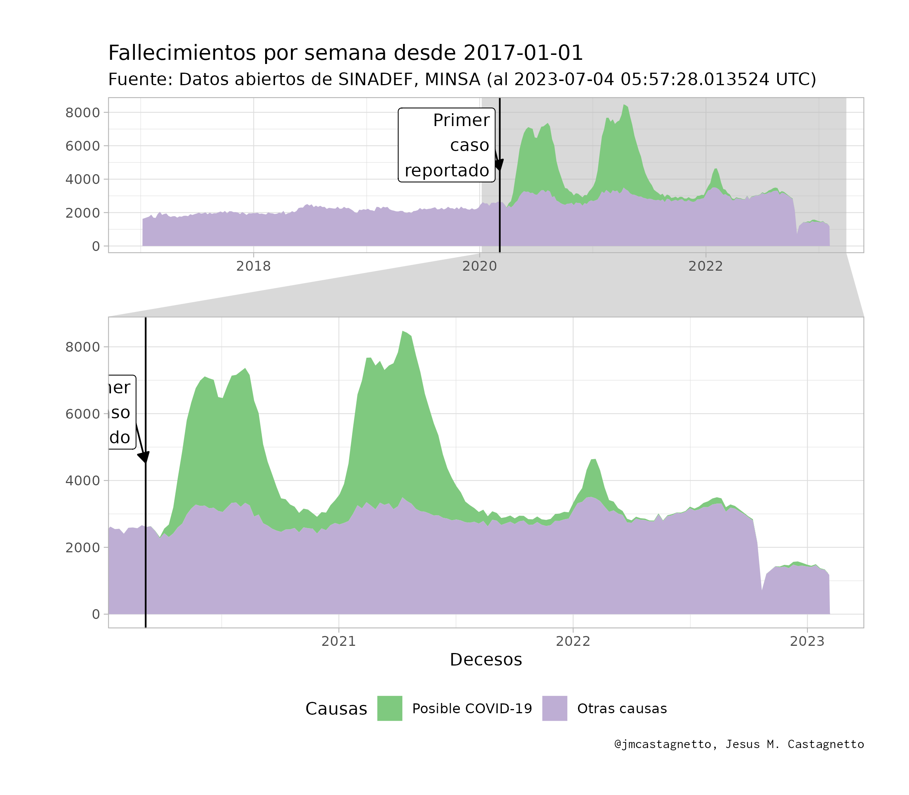
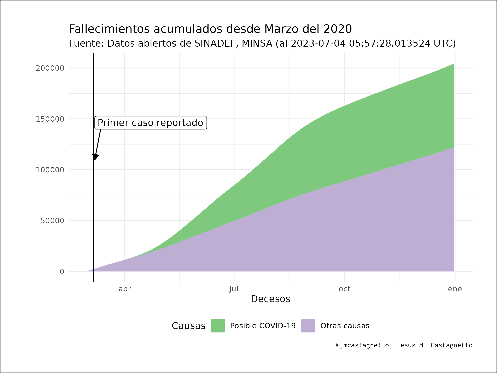

```{r include=FALSE, echo=FALSE}
library(tidyverse)
library(ggforce)
load("datos/sinadef-datos.Rdata")
hoy <- lubridate::now(tzone = "UTC")
```

[](https://zenodo.org/badge/latestdoi/270383647)

**Última actualización**: `r hoy` UTC

# Fallecimientos en Perú (SINADEF)

Análisis usando los datos de 

["Información de Fallecidos del Sistema Informático Nacional de Defunciones - SINADEF - [Ministerio de Salud]"](https://www.datosabiertos.gob.pe/dataset/informaci%C3%B3n-de-fallecidos-del-sistema-inform%C3%A1tico-nacional-de-defunciones-sinadef-ministerio)

## Notas

- **2020-06-08**:
  - Hoy el formato de fecha a cambiado de "DD/MM/YYYY" a "YYYY-MM-DD"
  - Los CSV ahora se guardarán comprimidos para no llegar a los límites de github

- **2020-06-16**:
  - Con la adición de seis (6) campos de causas, estoy calculando campos que marcan si las causas contienen la expresión regular: `"(CORONAVIRUS|COVID|SARS COV|SARS-COV)"`, y si se encuentra presente en al menos uno, marcarlo como posible registro de fallecimiento debido a COVID-19.

- **2020-06-22**:
  - Hoy los datos abiertos no presentan nada de la información anterior, como referencia futura, lo datos se pueden ver en [datos/20200622-fallecidos_sinadef.csv.gz]("datos/20200622-fallecidos_sinadef.csv.gz")

- **2020-06-23**:
  - Hoy los datos abiertos regresaron al formato anterior, con todo los campos con causas.

## Gráfico de fallecimientos por día desde marzo 2020

De los registros del SINADEF, se han empleado los 6 campos que contienen posibles causas del deceso, y se empleó la expresión regular `(CORONAVIRUS|COVID|SARS COV|SARS-COV)` para encontrar aquellas causas que pudieran ser por COVID-19. 

Luego, se marcaron los registros con al menos un campo que correspondía a la expresión regular mencionada.

```{r echo=FALSE}
desdeInicio <- sinadef_df %>% 
  mutate(
    year = lubridate::year(fecha),
    isoweek = lubridate::isoweek(fecha)
  ) %>% 
  #filter(anho == 2020 & mes >= 3) %>% 
  group_by(year, isoweek, covid19_causa) %>% 
  summarise(
    fecha = max(fecha),
    n = n()
  ) %>% 
  group_by(covid19_causa) %>% 
  mutate(
    csum = cumsum(n),
    causa_lbl = if_else(covid19_causa, "Posible COVID-19", "Otras causas") %>% 
      factor(
        levels = c("Posible COVID-19", "Otras causas"),
        ordered = TRUE
      )
  )

desdeMarzo <- sinadef_df %>% 
  filter(anho == 2020 & mes >= 3) %>% 
  group_by(fecha, covid19_causa) %>% 
  tally() %>% 
  group_by(covid19_causa) %>% 
  mutate(
    csum = cumsum(n),
    causa_lbl = if_else(covid19_causa, "Posible COVID-19", "Otras causas") %>% 
      factor(
        levels = c("Posible COVID-19", "Otras causas"),
        ordered = TRUE
      )
  )

```

Estimados:

- Fechas de registro: del `r min(sinadef_df$fecha, na.rm = TRUE)` al `r max(sinadef_df$fecha, na.rm = TRUE)`
- Número de registros : `r nrow(sinadef_df)`
- Probables registros por COVID-19 desde Marzo 2020: `r sum(sinadef_df$covid19_causa, na.rm = TRUE)`
- Fallecimientos por otras causas: `r sum(!sinadef_df$covid19_causa, na.rm = TRUE)`


```{r echo=FALSE}
tmp <- Sys.setlocale("LC_TIME", "es_PE.utf8")
min_fecha <- min(sinadef_df$fecha, na.rm = TRUE)
p1 <- ggplot(desdeInicio, aes(x = fecha, y = n, 
                       group = causa_lbl, fill = causa_lbl)) +
  geom_area() +
  geom_vline(xintercept = as.Date("2020-03-06")) +
  annotate("segment", x = as.Date("2020-02-15"), 
           y = 1.2*max(desdeInicio$n),
           xend = as.Date("2020-03-06"), 
           yend = 0.9*max(desdeInicio$n),
           arrow = arrow(length = unit(.25, "cm"), 
                         type = "closed")) +
  annotate("label", x = as.Date("2020-02-20"), 
           y = 1.2*max(desdeInicio$n),
           label = "Primer\ncaso\nreportado", hjust = 1) +
  scale_fill_brewer(name = "Causas", type = "qual") +
  labs(
    y = "",
    x = "Decesos",
    title = paste0("Fallecimientos por semana desde ", min_fecha),
    subtitle = paste0("Fuente: Datos abiertos de SINADEF, MINSA (al ",
                      hoy, " UTC)"),
    caption = "@jmcastagnetto, Jesus M. Castagnetto"
  ) +
  theme_light() +
  theme(
    legend.position = "bottom",
    plot.caption = element_text(family = "Inconsolata"),
    plot.margin = unit(rep(1, 4), "cm")
  ) + 
  facet_zoom(xlim = c(as.Date("2020-03-01"),
                      max(desdeInicio$fecha)))

ggsave(
  plot = p1,
  filename = "plots/fallecimientos-por-semana.png",
  width = 8,
  height = 7
)
```


## Gráfico de fallecimientos acumulados desde marzo 2020


```{r echo=FALSE}
tmp <- Sys.setlocale("LC_TIME", "es_PE.utf8")
p2 <- ggplot(desdeMarzo, 
             aes(x = fecha, y = csum, 
                       group = causa_lbl, fill = causa_lbl)) +
  geom_area() +
  geom_vline(xintercept = as.Date("2020-03-06")) +
  annotate("segment", x = as.Date("2020-03-13"), y = 1.2*max(desdeMarzo$csum),
           xend = as.Date("2020-03-07"), yend = 0.9*max(desdeMarzo$csum),
           arrow = arrow(length = unit(.25, "cm"), type = "closed")) +
  annotate("label", x = as.Date("2020-03-07"), y = 1.2*max(desdeMarzo$csum),
           label = "Primer caso reportado", hjust = 0) +
  scale_fill_brewer(name = "Causas", type = "qual") +
  labs(
    y = "",
    x = "Decesos",
    title = "Fallecimientos acumulados desde Marzo del 2020",
    subtitle = paste0("Fuente: Datos abiertos de SINADEF, MINSA (al ",
                      hoy, " UTC)"),
    caption = "@jmcastagnetto, Jesus M. Castagnetto"
  ) +
  theme_minimal() +
  theme(
    legend.position = "bottom",
    plot.caption = element_text(family = "Inconsolata"),
    plot.margin = unit(rep(1, 4), "cm")
  )

ggsave(
  plot = p2,
  filename = "plots/fallecimientos-acumulados.png",
  width = 8,
  height = 6
)

```

