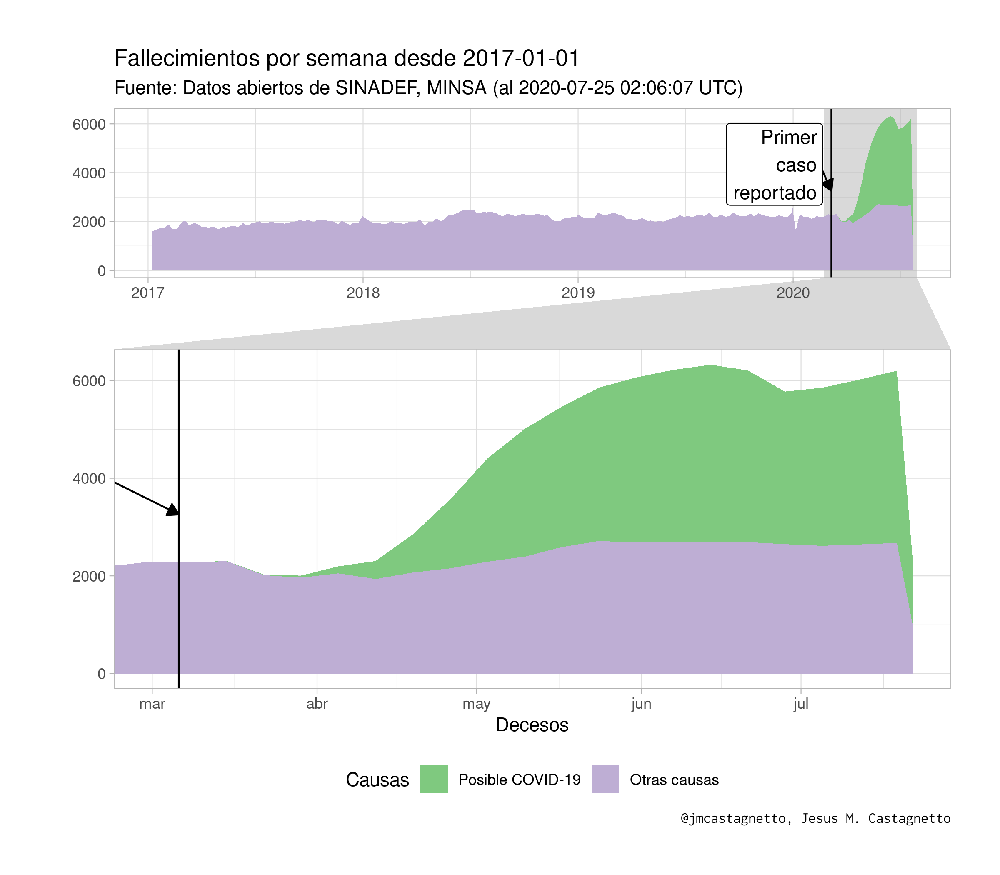

**Última actualización**: 2020-09-01 22:40:57 UTC

Fallecimientos en Perú (SINADEF)
================================

Análisis usando los datos de

[“Información de Fallecidos del Sistema Informático Nacional de
Defunciones - SINADEF - \[Ministerio de
Salud\]”](https://www.datosabiertos.gob.pe/dataset/informaci%C3%B3n-de-fallecidos-del-sistema-inform%C3%A1tico-nacional-de-defunciones-sinadef-ministerio)

Notas
-----

-   **2020-06-08**:
    -   Hoy el formato de fecha a cambiado de “DD/MM/YYYY” a
        “YYYY-MM-DD”
    -   Los CSV ahora se guardarán comprimidos para no llegar a los
        límites de github
-   **2020-06-16**:
    -   Con la adición de seis (6) campos de causas, estoy calculando
        campos que marcan si las causas contienen la expresión regular:
        `"(CORONAVIRUS|COVID|SARS COV|SARS-COV)"`, y si se encuentra
        presente en al menos uno, marcarlo como posible registro de
        fallecimiento debido a COVID-19.
-   **2020-06-22**:
    -   Hoy los datos abiertos no presentan nada de la información
        anterior, como referencia futura, lo datos se pueden ver en
        [datos/20200622-fallecidos\_sinadef.csv.gz](%22datos/20200622-fallecidos_sinadef.csv.gz%22)
-   **2020-06-23**:
    -   Hoy los datos abiertos regresaron al formato anterior, con todo
        los campos con causas.

Gráfico de fallecimientos por día desde marzo 2020
--------------------------------------------------

De los registros del SINADEF, se han empleado los 6 campos que contienen
posibles causas del deceso, y se empleó la expresión regular
`(CORONAVIRUS|COVID|SARS COV|SARS-COV)` para encontrar aquellas causas
que pudieran ser por COVID-19.

Luego, se marcaron los registros con al menos un campo que correspondía
a la expresión regular mencionada.

    ## `summarise()` regrouping output by 'year', 'isoweek' (override with `.groups` argument)

Estimados:

-   Fechas de registro: del 2017-01-01 al 2020-08-31
-   Número de registros : 474865
-   Probables registros por COVID-19 desde Marzo 2020: 62733
-   Fallecimientos por otras causas: 412132

Gráfico de fallecimientos acumulados desde marzo 2020
-----------------------------------------------------

